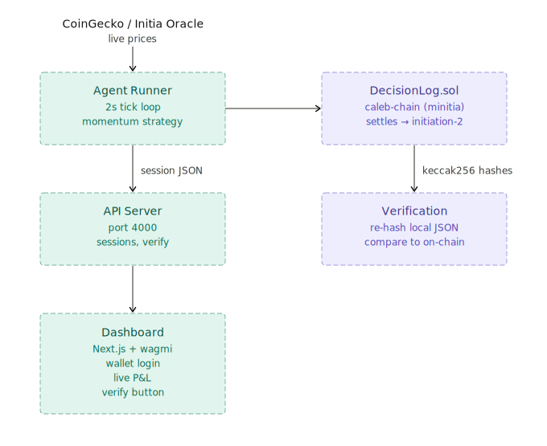

# caleb — verifiable autonomous trading agent on Initia

caleb is an autonomous trading agent that runs a momentum strategy against live prices and commits a cryptographic audit trail of every decision to an EVM minitia on Initia. you shouldn't have to trust the agent operator. every decision — the policy it ran under, the market data it saw, the AI verdict, the risk gates it checked, and what it executed — is hashed and committed to chain before any trade happens. anyone can verify the agent followed its rules without trusting anyone.

**live:** [caleb.sandpark.co](https://caleb.sandpark.co) · [app.caleb.sandpark.co](https://app.caleb.sandpark.co)

**repos:** [caleb-onchain](https://github.com/eipieq/caleb-onchain) · [caleb-app](https://github.com/eipieq/caleb-app) · [caleb (landing)](https://github.com/eipieq/caleb)

---

## architecture



---

## how the audit trail works

every agent cycle commits 5 ordered steps to chain:

| step | what it stores | why it matters |
|------|----------------|----------------|
| `POLICY` | hash of operating rules (max spend, cooldown, whitelist) | proves the agent's constraints before it acted |
| `MARKET` | hash of live price snapshot | proves what data the agent saw |
| `DECISION` | hash of AI verdict (BUY/SKIP, confidence, reasoning) | proves what the agent decided |
| `CHECK` | hash of 6-gate risk validation results | proves each safety gate ran |
| `EXECUTION` | hash of trade outcome or skip reason | proves what actually happened |

`DecisionLog.sol` enforces ordering — steps must arrive POLICY → EXECUTION in sequence. the contract rejects anything out of order and locks the session after finalization.

**verification:** the API re-hashes each step payload from the local JSON and compares to on-chain hashes via `getStep()`. tamper with the JSON and the hashes won't match. the dashboard exposes this as a one-click verify button.

**attestation:** any wallet can call `attest(sessionId)` to permanently record on-chain that they independently verified a session.

---

## the contract

`DecisionLog.sol` at `0x22679adc7475B922901137F22D120404c074044f` on `caleb-chain`

- `startSession(sessionId)` — opens a new audit session
- `commitStep(sessionId, stepKind, dataHash)` — records one step hash, enforces ordering
- `finalizeSession(sessionId)` — locks the session permanently
- `attest(sessionId)` — independent verification record
- `getStep / getSession / getAttestationCount` — read-only audit queries

---

## the agent

**runner** (`src/engine/runner.js`) — 2-second tick loop. reads live prices from Binance and the Initia oracle, runs the strategy, calls Venice AI (Llama 3.3-70B) to confirm or override the signal, then runs 6 risk gates before any execution. commits to chain selectively: only on trades, blocked gates, or 60s heartbeats. not every tick — that would spam the chain and make the audit log useless.

**strategies:**
- `momentum.js` — buy when price breaks out above rolling high, sell on reversal
- `mean-revert.js` — buy at oversold RSI, sell at overbought

**policy gates** (all must pass before any trade):
1. spend within `maxSpendUsd`
2. token is in whitelist
3. AI confidence >= threshold
4. cooldown elapsed since last trade
5. verdict is a valid value
6. token has a positive live price

---

## the dashboard

live at [app.caleb.sandpark.co](https://app.caleb.sandpark.co)

- connect your Initia wallet via InterwovenKit
- watch agent decisions stream in with verdict, confidence, and AI reasoning
- click any session to see the full 5-step audit timeline
- one-click verify: re-hashes all steps and compares to chain
- attest: sign a transaction to permanently record your verification on-chain
- configure your own strategy (per-wallet policy, applied on every tick)

---

## stack

| layer | tech |
|-------|------|
| chain | Initia minitia (minievm), settles to `initiation-2` |
| smart contract | Solidity (Hardhat), `DecisionLog.sol` |
| agent | Node.js (ESM), ethers.js |
| AI | Venice AI, Llama 3.3-70B |
| prices | Binance API + Initia oracle |
| API | plain Node.js HTTP |
| dashboard | Next.js, wagmi, InterwovenKit |

---

## running locally

requires Node.js 18+ and a `.env` file (see `.env.example`).

```bash
npm install

# run the agent
SIMULATE=true STRATEGY=momentum node src/engine/runner.js

# run the API server
SIMULATE=true node src/scripts/api-server.js
```

```env
INITIA_RPC_URL=http://64.227.139.172:8545
PRIVATE_KEY=<agent wallet private key>
DECISION_LOG_ADDRESS=0x22679adc7475B922901137F22D120404c074044f
SIMULATE=true
STRATEGY=momentum
```

---

## repo structure

```
contracts/
  DecisionLog.sol          — on-chain audit log

src/
  engine/
    runner.js              — 2s tick loop, selective chain commits
    portfolio.js           — P&L tracking
    position.js            — position sizing
  strategies/
    momentum.js            — breakout strategy
    mean-revert.js         — RSI reversion strategy
  chain/
    client.js              — ethers.js wrapper for DecisionLog
  market/
    index.js               — Binance + Initia oracle price fetching
    cache.js               — 500ms background price cache
  policy/
    index.js               — 6-gate risk validator
  venice/
    index.js               — Venice AI decision layer
  scripts/
    api-server.js          — HTTP API for the dashboard
    deploy.js              — contract deployment

sessions/                  — local session JSON files
data/
  portfolio.json           — persistent P&L state
  policies/                — per-wallet strategy configs
```

---

## build on caleb

caleb is designed as a platform. the core pipeline — commit decisions on-chain, verify them cryptographically — works for any use case where you need a tamper-proof record of what an agent did and why.

### the strategy interface

every strategy is a single function:

```js
function decide(prices, history, position, policy) {
  // prices   — { INIT: 1.23, ETH: 3800, USDC: 1 }
  // history  — array of past prices for the primary token, newest last
  // position — { token, sizeUsd, entryPrice } or null if flat
  // policy   — { maxSpendUsd, confidenceThreshold, allowedTokens, ... }

  return {
    verdict:    "BUY" | "SELL" | "SKIP",
    token:      "INIT",
    side:       "BUY" | "SELL" | null,
    amountUsd:  50,
    confidence: 0.85,       // 0-1, checked against policy.confidenceThreshold
    signal:     0.012,      // raw signal value (strategy-specific)
    reason:     "price broke above 20-tick high",
    strategy:   "my-strategy",
    timestamp:  Math.floor(Date.now() / 1000),
  }
}
```

that's it. implement `decide()`, pass it to the runner, and the entire 5-step pipeline runs automatically — policy commit, market snapshot, decision hash, risk gates, execution, all on-chain.

### the chain client

```js
import { ChainClient, STEP_KIND } from "caleb-onchain/chain"

const chain = new ChainClient({
  rpcUrl:          "https://your-initia-rpc.com:8545",
  privateKey:      "0x...",
  contractAddress: "0x...",  // deploy DecisionLog.sol to any EVM chain
})

// manual session (if you want full control)
const sessionId = ChainClient.makeSessionId(chain.address, timestamp)
await chain.startSession(sessionId)
await chain.commitStep(sessionId, STEP_KIND.POLICY, policyPayload)
await chain.commitStep(sessionId, STEP_KIND.MARKET, marketPayload)
await chain.commitStep(sessionId, STEP_KIND.DECISION, decisionPayload)
await chain.commitStep(sessionId, STEP_KIND.CHECK, checkPayload)
await chain.commitStep(sessionId, STEP_KIND.EXECUTION, execPayload)
await chain.finalizeSession(sessionId)

// each payload is JSON-serialized with sorted keys, then keccak256 hashed.
// the hash goes on-chain. the full payload goes in the StepCommitted event.
// anyone can recompute the hash from the payload and compare.
```

### the policy engine

9 gates that run in parallel before any trade executes:

| gate | what it checks |
|------|---------------|
| `spendLimit` | amount ≤ `maxSpendUsd` |
| `tokenWhitelist` | token is in `allowedTokens` |
| `signalStrength` | confidence ≥ `confidenceThreshold` |
| `cooldown` | enough time since last trade |
| `verdictValid` | verdict is BUY, SELL, or SKIP |
| `marketSanity` | token has a positive price |
| `maxPosition` | won't exceed `maxPositionUsd` exposure |
| `maxDrawdown` | position isn't past `maxDrawdownPct` loss |
| `availableBalance` | enough USDC to fund the trade |

all gates must pass. the full gate results are committed on-chain as the CHECK step, so anyone can see exactly which gate blocked a trade and why.

```js
import { runPolicyCheck } from "caleb-onchain/policy"

const check = await runPolicyCheck(signal, market, policy, [], position, portfolio)
// check.passed    — boolean
// check.blockedBy — name of the first gate that failed, or null
// check.gates     — { spendLimit: { passed: true, reason: "$50 ≤ limit $100" }, ... }
```

### verification

```js
import { ChainClient } from "caleb-onchain/chain"

// re-hash a payload locally and compare to what's on-chain
const localHash  = ChainClient.hashPayload(step.payload)
const onChain    = await chain.getStep(sessionId, stepIndex)
const match      = localHash === onChain.dataHash
// match = data hasn't been tampered with
```

this is the core trust mechanism. the agent commits hashes before acting. anyone can re-hash the full payloads and compare. if someone edits the session data after the fact, the hashes won't match.

### use cases

**trading competitions** — each competitor runs their own strategy against the same contract. the chain is the scoreboard. nobody can fake results because every trade is hashed on-chain before execution. compare P&L across wallets to rank.

**model testing** — plug in your ML model as a `decide()` function. run it against live prices. every prediction and outcome is committed on-chain with timestamps. you get a tamper-proof track record of model performance over time.

**strategy marketplace** — publish strategies as modules that export `decide()`. users subscribe and run them with their own wallet and policy constraints. the on-chain audit trail lets users verify a strategy's real historical performance before subscribing.

**AI agent benchmarking** — swap the AI decision layer (Venice/Llama) for any model. the same policy gates and verification pipeline apply. compare how different models perform under identical market conditions with identical risk constraints.

**audit & compliance** — the 5-step pipeline creates a complete audit trail: what rules were in effect, what data was seen, what was decided, what was checked, what happened. all cryptographically committed in order. `attest()` lets third parties record their independent verification on-chain.

### policy config

```js
const policy = {
  maxSpendUsd:          50,     // max per trade
  confidenceThreshold:  0.3,    // min signal strength to proceed
  cooldownSeconds:      3600,   // min seconds between trades (0 for HFT)
  allowedTokens:        ["INIT", "ETH", "USDC"],
  maxPositionUsd:       200,    // max exposure in one token
  maxDrawdownPct:       5,      // halt if position down > 5%
}
```

the policy is committed on-chain as the first step of every session. this means anyone verifying a session can see exactly what constraints the agent was operating under — not just what it did, but what it was allowed to do.

---

## design decisions

**why a custom minitia instead of initiation-2 directly?** the agent commits on every meaningful event. on a shared testnet that's noise. a dedicated chain keeps the audit log clean and gives full control over gas pricing and block times.

**why hash-only on chain instead of full payloads?** a full market snapshot is 2-5KB per step. hashes are 32 bytes. the full data lives in `sessions/` — the chain stores the fingerprints. the `StepCommitted` event does include the full payload as a string, so data can be recovered from chain events even if the local files are lost.

**why selective commits (not every tick)?** a 2s loop produces 43,000+ ticks/day. most are SKIP. committing every tick would spam the chain and make the audit log unreadable.

**SIMULATE=true** — swap execution is mocked. the agent makes real decisions based on real prices but doesn't call a DEX. everything else (policy, chain commits, portfolio tracking, AI decisions) runs for real.
